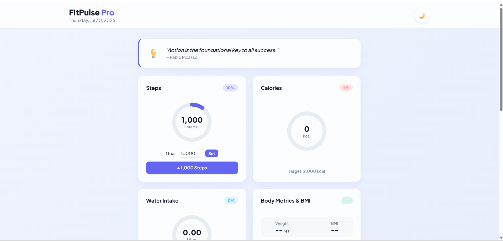
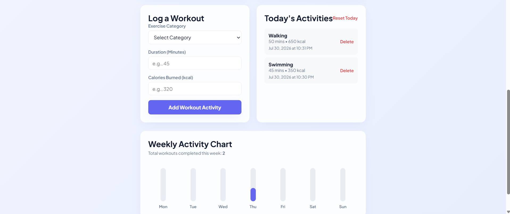
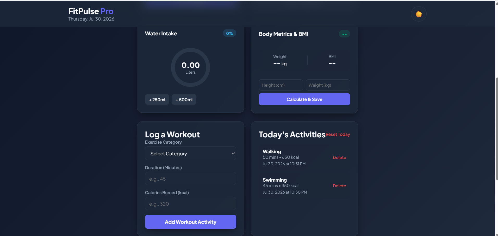

# 🏋️ Fitness Tracker App

A responsive Fitness Tracker web application built using HTML, CSS, and JavaScript.

## 🚀 Features

- Add and manage daily workouts
- Track calories burned
- Track workout duration
- Dashboard with progress summary
- Workout history
- Dark Mode
- Local Storage support
- Responsive design

## 🛠️ Technologies Used

- HTML5
- CSS3
- JavaScript
- Local Storage

## 📸 Screenshots

### Dashboard

### Add Workout

### Dark Mode

## 🌐 Live Demo

https://priyakarnawadi.github.io/Fitness_Tracker_App/

## 👩‍💻 Author

**Priya Karnawadi**
